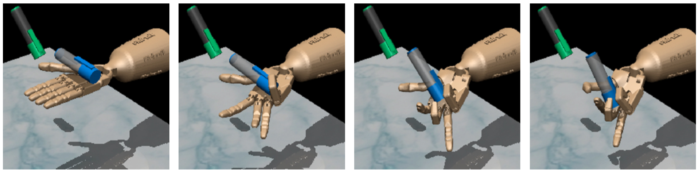
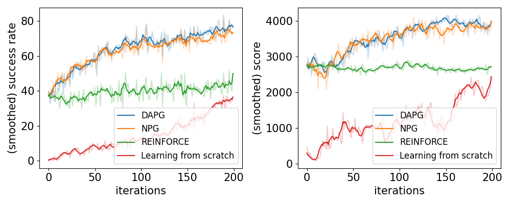
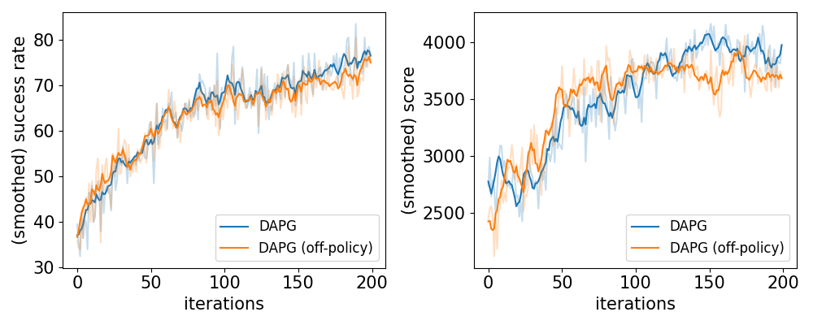
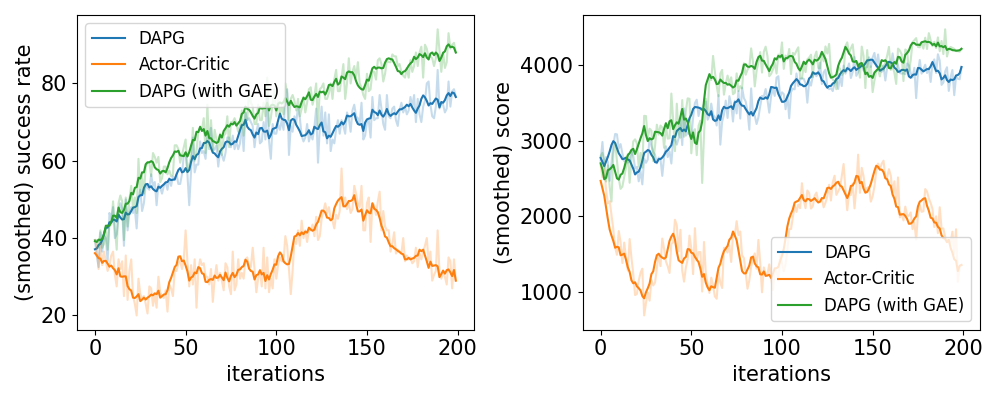
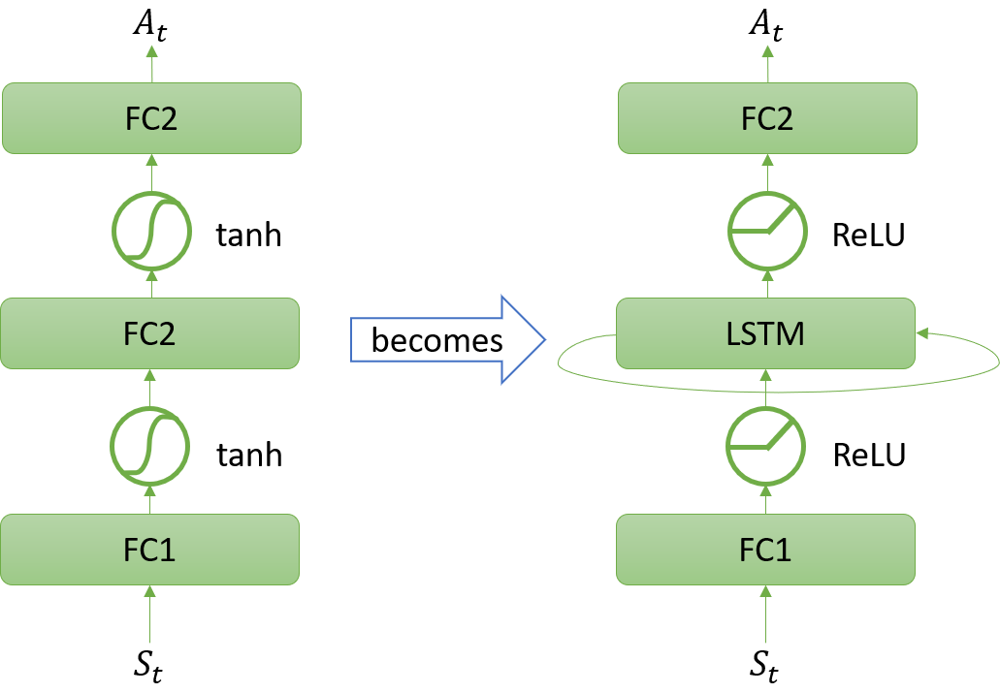
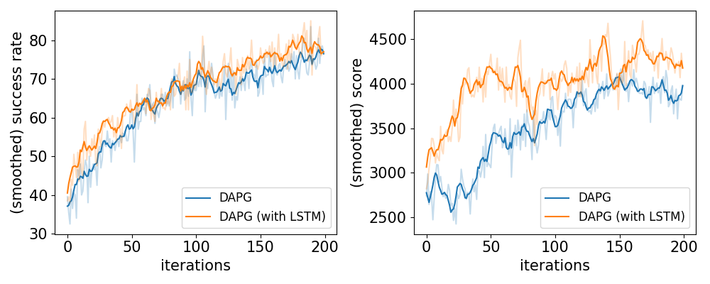
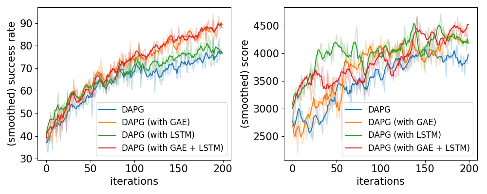
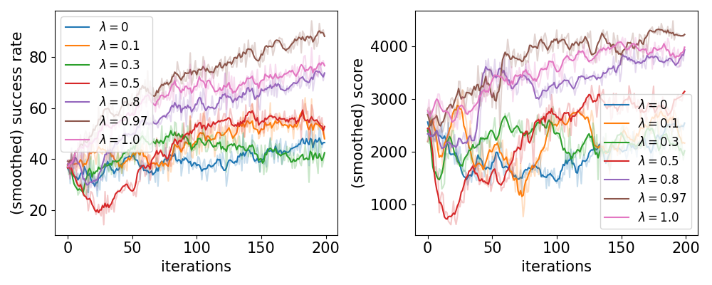

# RL_Policy_Gradient
- [RL_Policy_Gradient](#rl_policy_gradient)
  - [1. How to set up the environment?](#1-how-to-set-up-the-environment)
  - [2. Overview](#2-overview)
    - [2.1 Environment](#21-environment)
    - [2.2 Problem Formulation](#22-problem-formulation)
  - [3. Our Extensions](#3-our-extensions)
    - [3.1 DAPG verification](#31-dapg-verification)
    - [3.2 Off-Policy Sampling](#32-off-policy-sampling)
    - [3.3 Bootstrapping](#33-bootstrapping)
    - [3.4 Recurrent Plolicy](#34-recurrent-plolicy)
    - [4. Conclusion](#4-conclusion)

## 1. How to set up the environment?
* This project is an extension based on [Aravind Rajeswaran's project](https://github.com/aravindr93/hand_dapg). For the detailed setup instructions and dependencies, please refer to his project.
* This repo only includes the files created/modified by us. So if you want to run our code, please first download the code by Aravind, and substitute the original code with ours.

## 2. Overview
### 2.1 Environment

*Fig. 1. In-hand manipulation task, whose goal is to re-position the blue pen to match the orientation of the green target. (Only the orientation, the target position is defined elsewhere)*

To setup our experiments, we use an external customized [OpenAI Gym environment](https://github.com/vikashplus/mj_envs) simulated with [MuJoCo physics engine](http://www.mujoco.org)

The platform simulates the analogue of a $24$ DoF ADROIT robot hand as the controlled agent for the task. As shown in Fig.2, the blue arrows mark the $24$ controllable hand joints. Besides, the platform also provides very realistic simulations of physics by carefully modeling the kinematics, dynamics and sensing details. It enables us to access the measurements of joint positions, object poses, etc, and to visualize the demonstrations of any given policies.

### 2.2 Problem Formulation
\
*Fig. 2. Simulated ARDOIT robot hand. The blue arrows represent each of the controllable hand joints.*
The problem is formulated as an episodic task. The episode will terminate either when a failure occurs or it exceeds the preset maximum steps (e.g. 200). Specifically, the failure state is defined that the pen falls from the hand, ie. the height of the pen position is less than a threshold.

The associated Markov Decision Process (MDP) is defined as $\mathcal{M} =\{\mathcal{S}, \mathcal{A}, \mathcal{R}, \mathcal{T}, \gamma\}$, where $\mathcal{S} \subset \mathbb{R}^n$ is the state space, $\mathcal{A} \subset \mathbb{R}^m$ is the action space, $\mathcal{R}\subset \mathbb{R}$ is the reward, $\mathcal{T}: \mathcal{S} \times \mathcal{A} \rightarrow \mathcal{S} \times \mathcal{R}$ is the transition dynamics unknown to us, and $\gamma \in [0, 1)$ is the discount factor.

The goal of this problem is to find the optimal stochastic policy such that it maximizes the expected discounted returns:

$$\textrm{maximize}_{\pi} \quad \mathbb{E}_{\pi, \mathcal{M}}\bigg[\sum_{t=0}^T \gamma^t R_t\bigg]$$

where $R_t$ is the reward received at step $t$, and $T$ is the length of the episode.

For our specific application, the detailed definitions for the components in our problem formulation are described below:

* **State**: The state is continuous represented by a $45$-dimensional vector ($n=45$). Each of the dimensions represents one of the measurements including hand joint angles ($24$ DoF), pen pose ($6$ DoF), pen linear velocity ($3$ DoF), target pen orientation ($3$ DoF), and difference of current and target pen pose ($6$ DoF). These measurements can be directly observed and accessed from the simulator.
* **Action**: The action is also continuous, represented by a $24$-dimensional vector ($m=24$). Each of the dimensions is defined as the desired angle at the next step for one of the $24$ joints on the robot hand.
* **Reward**: The reward we use is heavily shaped to help with faster learning. The shaping of the reward is adopted from the default setting of the environment we use. Basically, the reward is a function of the state, mainly related to the difference of current and target pen pose. Additionally, bonus for success and penalty for failure are both applied in shaping the reward. The reward can be explicitly expressed as

$$R_t = R_{diff} + R_{bonus} + R_{penalty}$$

$$
\begin{aligned}
  R_{diff} = -||p&_t - p_*||_2 + \langle\phi_t, \phi_*\rangle\\R_{bonus} = +10&\quad \text{if} ||p_t - p_*||_2 < 0.075\quad
              \text{and}\quad \langle\phi_t, \phi_*\rangle > 0.9\\
              +50&\quad \text{if} ||p_t - p_*||_2 < 0.075\quad
              \text{and} \quad \langle\phi_t, \phi_*\rangle > 0.95\\
              0&\quad \text{otherwise}\\
    R_{penalty} = -5& \quad\text{if}\quad p_t^{(z)} < 0.075\\
            0& \quad \text{otherwise}
  \end{aligned}
$$
where $p_t$, $p_*$, $\phi_t$, $\phi_*$ respectively denote the current position, target position, current orientation and target orientation of the pen at time $t$; $p_t^{(z)}$ is the height of the pen at time $t$; and $\langle\cdot,\cdot\rangle$ denotes the inner product of two given vectors.

## 3. Our Extensions
### 3.1 DAPG verification

*Fig. 3. Evaluations in experiments verifying effectiveness of different strategies used in DAPG.*

The DAPG algorithm is derived from the classical REINFORCE with Baseline, which is a Monte-Carlo policy gradient method for optimizing the stochastic policy. It involves one neural network for the value-function baseline $\hat{v}(S, \mathbf{w})$ and another network for the policy $\pi(A|S, \theta)$. At the beginning of each training iteration, it will first sample a batch of trajectories using current policy, and estimate the advantage $\delta_t$ of each step with the actual return $G_t$ by
$$
    \begin{aligned}
        G_t &= \sum_{k=t+1}^T \gamma^{k-t-1} R_k\\
        \delta_t &= G_t - \hat{v}(S_t, \mathbf{w})
    \end{aligned}
$$
And then the baseline network weights $\mathbf{w}$ and the policy network weights $\theta$ will be successively updated with a small step size $\alpha^{\mathbf{w}}$ and $\alpha^{\theta}$ by
$$
    \begin{aligned}
        \mathbf{w}_{t+1} &= \mathbf{w}_t +  \alpha^{\mathbf{w}}\delta_t\nabla\hat{v}(S_t, \mathbf{w})\\
        \theta_{t+1} &= \theta_t +  \alpha^{\theta}\delta_t\nabla \ln \pi(A_t | S_t, \theta)
    \end{aligned}
$$

For the major contributions of DAPG, it adopts additional training strategies which are crucial for fast convergence. These strategies can be summarized as the followings:
\begin{enumerate}
* Pre-training with behavior cloning. Utilizing an expert demonstration dataset $\mathcal{D}$ which includes $25$ pre-collected trajectories, the policy network will be pre-trained with supervised learning by maximizing the likelihood of actions observed in the demonstration dataset:
$$
    \begin{aligned}
        \rm{maximize}_{\theta} \quad \sum_{(S, A) \in \mathcal{D}} \ln \pi(A|S, \theta)
    \end{aligned}
$$
* Natural policy gradient (NPG). In the fine-tuning phase of the training, instead of using the vanilla REINFORCE gradient $g$ expressed in Eq. 7, it will make a normalized gradient ascent update to the policy pre-conditioned with the Fisher Information Matrix $F_{\theta_t}$:
$$
    \begin{aligned}
        g &= \delta_t\nabla \ln \pi(A_t | S_t, \theta)\\
        \theta_{t+1} &= \theta_t +  \sqrt{\frac{\alpha^{\theta}}{g^T F_{\theta_t}^{-1} g}} F_{\theta_t}^{-1} g
    \end{aligned}
$$
* Augmented policy gradient from demo data. In fine-tuning, besides using the newly sampled data at each training iteration to compute the policy gradient, DAPG also keeps utilizing the demonstration data to help shape the gradient. Briefly speaking, this is done by merging the gradient computed from the demonstration data into the original gradient computed from the newly sampled data with a small decaying weight. This strategy can elegantly guide the exploration at the early stage of fine-tuning. *This technique is able to better shape the policy gradient and make faster progress on the policy improvement.*

The results of our verifying experiments are shown in Fig.3, where the plotted curves show how the performance evolves with respect to training iterations. For better visualization, all the curves are smoothed by averaging over successive $5$ iterations. We use two evaluations to compare the performance of different methods. **One metric is the success rate**. It is considered as a success when the difference of the pen pose and its target is within a small tolerance at the end of the episode. **Another metric is the score**, which is the averaged total rewards among the evaluation episodes.

From the experiment results, compared with learning from scratch, behavior cloning with demonstrations is able to provide a good initialization of the policy network. And compared with the vanilla REINFORCE which improves very slow, NPG is pretty effective on helping with fast convergence.  

### 3.2 Off-Policy Sampling

*Fig. 4. Evaluations in experiments on off-policy sampling*

The first potential problem of the original DAPG is that it uses on-policy reinforcement learning for fine-tuning. This could be data inefficient, and more importantly, it might not be able to sufficiently explore the region near the optimal policy when the demonstration data used for pre-training is not optimal.

Therefore, we propose to encourage more off-policy exploration by sampling with a mixture policy $\beta \pi_t + (1-\beta) \pi_{t-1}$, which combines the current policy $\pi_t$ and the policy from the previous iteration $\pi_{t-1}$ with a weight $\beta$. The results are shown in Fig.~\ref{fig:off_policy}. It can be observed that this simple off-policy sampling improves the performance a little in the early iterations, but it does not make a big difference afterwards. 

### 3.3 Bootstrapping

*Fig. 5. Evaluations in experiments on bootstrapping.*

In policy gradient methods, the estimation of the advantage function is important to policy improvement since it is highly related to estimating the policy gradient. As introduced previously, DAPG estimates the advantage by Monte-Carlo, which is unbiased due to the use of actual returns. However, this estimation is presumed to be of high variance, and is thus likely to slow down the training.

To deal with this probable high variance of advantage estimation in DAPG, we propose to use Temporal Difference (TD) bootstrapping. One simple example of bootstrapping is Actor-Critic, which uses one-step TD to estimate the advantage:
$$
\begin{aligned}
    \delta_t = R_t + \gamma \hat{v}(S_{t+1}, \mathbf{w}) - \hat{v}(S_t, \mathbf{w})
\end{aligned}
$$
This estimation in Actor-Critic is able to achieve low variance, but it is also presumably bad as verified in Fig.5, since the bias is high due to the inaccurate approximation of the value-function baseline $\hat{v}$. However, if the estimation of the advantage is well balanced between bias and variance, the training process will potentially benefit a lot from it. Therefore, we finally apply Generalized Advantage Estimation (GAE), which is a useful technique to adjust the bias-variance trade-off.

GAE is defined as the exponentially-weighted average of k-step TD estimators, which can be simplified as:
$$
\begin{aligned}
    \delta_t^{\operatorname{GAE}(\gamma, \lambda)} & := (1-\lambda)\sum_{k=1}^\infty \gamma^{k-1}\delta_t^{(k)}\\
    & = \sum_{k=0}^\infty (\gamma \lambda)^k \delta_{t+k}^{(1)}
\end{aligned}
$$
where $\delta_t^{(k)}$ is the k-step TD residual:
$$
\begin{aligned}
    \delta_t^{(k)} = \sum_{l=0}^{k-1} \gamma^l R_{t+l} + \gamma^k \hat{v}(S_{t+k}, \mathbf{w}) - \hat{v}(S_t, \mathbf{w})
\end{aligned}
$$
To note, $\delta_t^{\operatorname{GAE}(\gamma, 0)}$ is exactly the one-step TD same as in Actor-Critic; in contrast, $\delta_t^{\operatorname{GAE}(\gamma, 1)}$ is $\gamma$-just, and thus has low bias regardless of the accuracy of $\hat{v}$, but it has high variance due to the sum of terms. With carefully tuned $\lambda$, we can successfully improve the performance of DAPG by a great margin, as shown in Fig.5

### 3.4 Recurrent Plolicy
The policy used in DAPG only depends on the current state and has no memory of previous states. This assumption can become too simple to make good decisions in practice. Intuitively, a better decision could be made if some important information obtained through interactions with the environment in previous steps, such as the weight and implicit shape of the object, can propagate forwards.

Therefore, we propose to replace the original policy network modeled by a $3$-layer fully-connected neural network with Long Short-Term Memory (LSTM). architecture as shown in Fig.6

*Fig. 6. Replacement of the policy network with LSTM architecture. The left is the original fully-connected policy network where the activations are tanh; the right is our newly applied LSTM policy network where the activations are changed to ReLU.*

The experimental results are shown in Fig.7, it can be obviously observed that the newly applied LSTM policy eventually helps accelerate the learning.

*Fig. 7. Evaluations in experiments on LSTM policy*

### 4. Conclusion
* (Behavior cloning)Pre-training with demonstrations is very helpful for initializing the policy
* GAE and LSTM policy both help accelerate the learning, and outperform the original DAPG settings in terms of the success rate and total rewards. (Shown in Fig.8)
* Mixed off-policy sampling's performance is almost the same with the original on-policy DAPG algorithm
* For the bootstrapping extension, We did several experiments to search over different values of $\lambda$ with fixed $\gamma$. Particularly, we tested with $\lambda$ = 0 (Actor-Critic), 0.1, 0.3, 0.5, 0.8, 0.97, and 1.0. As shown in Fig.9, the best balance between bias and variance is the case of $\lambda$ = 0.97.
* Applying LSTM policy significantly improved the converging speed

For more detailed analysis, please refer to our [report](presentation_report/report.pdf).

*Fig. 8. Summarized results of experiments on our extensions*

*Fig. 9. Performance of GAE applied with different λ value.*